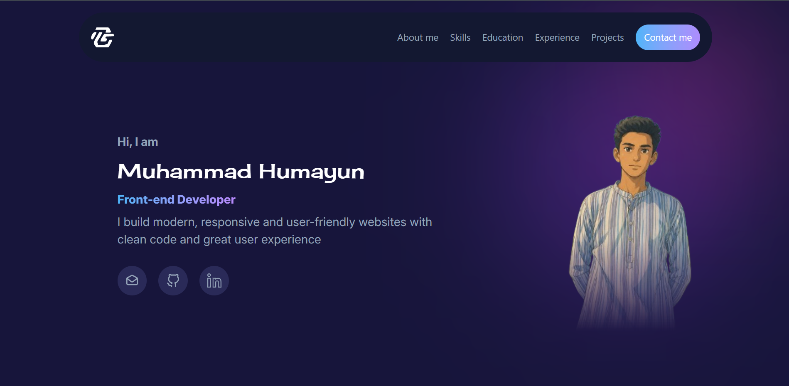

# Personal Portfolio

A responsive personal portfolio website built with **HTML** and **Tailwind CSS** to showcase my skills, projects, and contact information.

## Features

- Responsive design
- Modern and clean UI
- Built with Tailwind CSS
- Smooth navigation
- Projects showcase
- Skills section
- Contact section

## Technologies Used

- HTML5
- Tailwind CSS

## Project Structure

```
Portfolio/
├── src/
│   ├── index.html
│   ├── input.css
│   └── output.css
├── Icons/
├── package.json
├── package-lock.json
└── README.md
```

## Installation

1. Clone the repository

```bash
git clone https://github.com/HumayunCoder/portfolio.git
```

2. Navigate to the project folder

```bash
cd portfolio
```

3. Install dependencies

```bash
npm install
```

4. Start Tailwind CSS

```bash
npx @tailwindcss/cli -i ./src/input.css -o ./src/output.css --watch
```

5. Open `src/index.html` in your browser.

## Preview



## License

This project is open source and available under the MIT License.